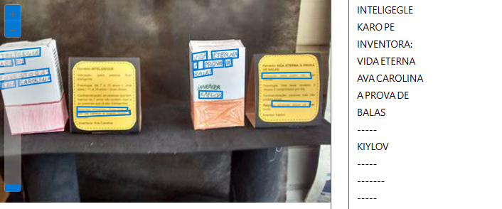
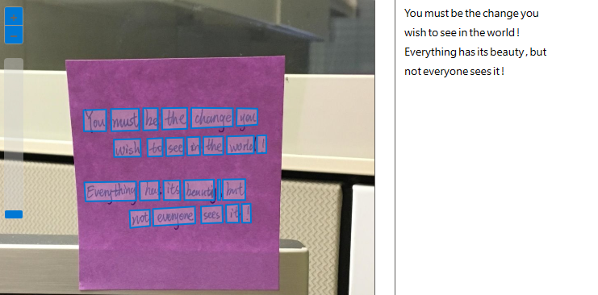

# 🖼️ Microsoft-Azure-Image-AI

## 🔍 How Use
- First you create your account on Microsoft: Azure, after this we can create a new Resource and try this AI.

- Just read the documentation to do this.

> On Resource we scroll down and click in Optical character recognition, than click in Extract text from images.

- Now u can search images to test. 

## 🤓 Possibility
With this we can do scanners, accessible software for everyone.

## ✍️ Test

## 📖 Documentation

- [**Microsoft: Azure doc**](https://learn.microsoft.com/en-us/azure/ai-services/computer-vision/concept-ocr)

- [**DIO Class**](https://web.dio.me/lab/trabalhando-com-machine-learning-na-pratica-no-azure-ml/learning/88f82571-5450-40a9-9f4d-253416f2530e)

#### Obs.. I'm working in my english..